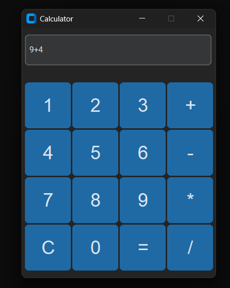

This is my first programming project, built with Python.  
It's a graphical calculator that can perform basic operations.

## Features:
- GUI interface
- Buttons for 1, 2, 3, +
- Calculates using Python
- Basic error handling

## To Improve:
- Prevent multiple operators (like "++" or "--")
- Add more math functions
- Make the design prettier

## Made by:
A 16-year-old self-taught beginner who built this after 3 days of learning Python.

## Screenshot:

